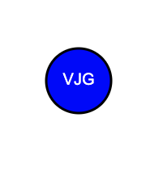

## SVG PAL

## Description

SVG Pal is a personal node tool that generates a simple svg logo based off a terminal prompt. You will be asked for up to 3 letters, text color, a shape, and background color. The svg logo will be created in another file

## Visuals

## Usage

To use the webpage, you can review each section by clicking on the header links at the top of the page. To inspect each element, you can open the Chrome DevTools by pressing Command+Option+I (macOS) or Control+Shift+I (Windows). A console panel should open either below or to the side of the webpage in the browser. There you can navigate to the Accessibility tab to highlight each picture element,

## Credits

created by vin galante

## License

MIT License. All rights reserved.
